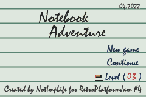
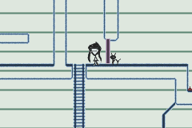
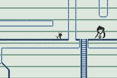
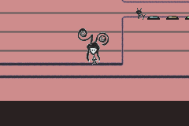

# Notebook Adventure

A submission for Retro Platform Jam 4

# The idea 

I spent whole days trying to understand Pokémon Emerald's inner workings by watching no-cash's VRAM viewer with tired empty eyes. _"It's no good..."_ - I said to myself. _"How in the world are you gonna create an engine capable of doing even a fraction of what you see?"_. I have to admit: I'm bored of this question my subconscious keeps asking me for more than 6 years. _"You know what? I'll do it! I'm no longer that 2016 guy who replaces the example DrunkenCoders logo with some other bitmap image and calls that thing «homebrew»."_ Genuinely speaking, what I'm afraid of? What could go wrong in starting a new project? Either it will become a piece of ~software~ art cummulating both my entire work and satisfaction, or it will turn out to be another one of my hundreds dead attempts floating around in my filesystem. 

I watch the sunrise of a new day with a resonant promising feeling. Partially self-encouraged to undertake another one of my abyssal coding session, I make myself comfortable at my desk while opening the [spell book](https://problemkaputt.de/gbatek.htm) and clicking a can of Dr. Pepper. There are my (the programmer's) mere weapons, along with a pen and a piece of paper full of unrecognizable notes from the precedent day. The holy devkitPro libraries, the classy-ish Notepad++ and the bizarre world of Makefile. And a -somewhat- experience turning -someway- into a curse which it seems that -somehow- I'm the only one I can relate to. 

My whole activity as a homebrew-ist fits perfectly in  8 words: _Long hours of coding, hard days of debugging_. But at least, I'm giving it my all (time, luck, praises, swears, effort), then I desperately smash that Arrow up + Enter combo in the terminal in the hope of seeing any reliable progress. I wanna do it - and I'll do it. For the sake of my dreams, for the taste of my childhood.

After drawing myself repeatedly on the edge of exhaustion, I felt like I was touching the absolute. The engine is finally working. _"Good job, N•I•L! Remember what you said? Pokémon Emerald, uh...? Not even close!"_ My so-called replica of the game is so different than my source of inspiration that I can call it an unique engine in itself. However, I felt no disappointment. I'd rather say that I felt a spark of revelation. It's the fact that technically speaking I was followed the wrong path from the very beginning, but I actually did arrive to a correct answer. _My own_ correct answer. My buggy (correct?) answer. 

Time passed, and meanwhile I managed to get caught up in the moment enjoying the enthusiasm of writing my very first paltformer. I was so absorbed in what I was doing that I commited the huge sin of losing sight of crucial springs of crashes and errors. Disable Backgrounds - it works. Disable Sprites - again, works fine. Put everything together - and watch how the CPU gets stuck into an infinite cycle with savor of _bad alloc_. _"Now, I've done it. Where in those thousands of lines is the problem? This project wasn't mean to exist in the first place, was it?"_ 

```
void * operator new(size_t size)
{		
	void * p = malloc(size);
	DEBUG_MSG("%x. + %x : %i  [%s]\n",cnt, p,size,dbg_ctx);
	dbg_ctx="";
	cnt++;	
	return p;
}
```

You can feel the desperation of making the _new_ and _delete_ operators write logs to the SRAM (_"Uhm, N•I•L, you've heard of the great no$gba's debugger, right?"_ - Yes, I have, but I don't know how to use it, now shut up, I'm concentrating!). After three days of worthless brainstorming and bad code dianostics, I randomly started to change between static and dynamic arrays. It worked!, though many things still remained unexplainable to my humble knowledge. 

While a bunch of other projects I worked on thought me about skill and patience, this one has a truly remarkable mention: I refused to abandon it, no matter what (and you won't hear this from my mouth very often). It has its flaws (still, but I think I should live with that) and I feel like me and my work are chiseling each other. I ultimately learned how to use the damn debugger, which spared me from a lot of struggle with discovering stuff like a strcmp-ed null pointer which could mess up the entire execution. Also, I was suprised that the ELF file is not just an intermediate form between code and the built ROM, actually it can also be executed (though the expansion "_Executable_ Linked Format" was not enough for N•I•L to understand a blatant fact like this). And guess what? It contains symbols! Useful for - DEBUGGING! Phhoaaa... I'm grateful to my life that it showed me a thing like this only at the end of such a hardcore coding challenge. 

All these being said, I have to add: _Nevermind_. Creating this game was fun. It really _was_ fun. Nothing makes my blood pump more than waiting blindly changing a line and raising the phylosophical question: will it crash, or will it not? If this wasn't enough, this project also had me try [MilkyTracker](https://milkytracker.org/) and made me laugh at my [not-so-old attempt](https://github.com/NotImplementedLife/brekstascat/blob/master/src/nowhere/music.asm) to mime a composer.

This game is my up-to-now best, and I'm incredibly excited to show it to the world (or the ~10 people who will play it, in the optimistic case).

And I din it... _super_ !

# How to build

Building process requires te [devkitPro](https://devkitpro.org/) environment to be installed on your system.

```
git clone https://github.com/NotImplementedLife/NotebookAdventure
cd NotebookAdventure
make -f Makefile
```

# Screenshots

</img>
</img>
</img>
</img>

# Credits

- I should thank [DogedomStudios](https://twitter.com/DogedomStudios) for hosting [Retro Platform Jam #4](https://itch.io/jam/retro-platform-jam-4), the pre-text and also the factor without which Notebook Adventure wouldn't have come into existence
- [BowersIndustry](https://github.com/BowersIndustry) for discovering a ladder bug in the first level
- [modarcihve.org](modarcihve.org) for providing spectacular retro music-related resources
- [libgba](https://github.com/devkitPro/libgba) for the GBA development tools
- any GBA-related forum, article, post, source codes all over the internet, no matter I have read them or not. They are amazing and each one is a valuable source of answer for any of your possible questions.

# External links

- https://notimplementedlife.itch.io/notebook-adventure